# Jarkom-Modul-3-A07-2021
Laporan resmi berisi dokumentasi soal Jarkom Modul 3.
---
Kelompok A-07:
- [Arkan Aulia Farhan](): 05111940000128
- [Muchamad Maroqi Abdul Jalil](https://github.com/maroqijalil): 05111940000143
- [Syamil Difaul Haq Sukur](https://github.com/Syamil28): 05111940000196
---

## Soal praktikum:

Luffy yang sudah menjadi Raja Bajak Laut ingin mengembangkan daerah
kekuasaannya dengan membuat peta seperti berikut:


Luffy bersama Zoro berencana membuat peta tersebut dengan kriteria
**EniesLobby** sebagai DNS Server, **Jipangu** sebagai DHCP Server,
**Water7** sebagai Proxy Server **(1)**, dan **Foosha** sebagai DHCP
Relay **(2)**. Luffy dan Zoro **menyusun peta tersebut dengan hati-hati
dan teliti**.

Ada beberapa kriteria yang ingin dibuat oleh Luffy dan Zoro, yaitu:

1.  Semua client yang ada **HARUS** menggunakan konfigurasi IP dari DHCP Server.

2.  Client yang melalui Switch1 mendapatkan range IP dari \[prefix IP\].1.20 - \[prefix IP\].1.99 dan \[prefix IP\].1.150 - \[prefix IP\].1.169 **(3)**

3.  Client yang melalui Switch3 mendapatkan range IP dari \[prefix IP\].3.30 - \[prefix IP\].3.50 **(4)**

4.  Client mendapatkan DNS dari EniesLobby dan client dapat terhubung dengan internet melalui DNS tersebut. **(5)**

5.  Lama waktu DHCP server meminjamkan alamat IP kepada Client yang melalui Switch1 selama 6 menit sedangkan pada client yang melalui Switch3 selama 12 menit. Dengan waktu maksimal yang dialokasikan untuk peminjaman alamat IP selama 120 menit. **(6)**

Luffy dan Zoro berencana menjadikan **Skypie** sebagai server untuk jual
beli kapal yang dimilikinya dengan **alamat IP yang tetap** dengan IP
\[prefix IP\].3.69 **(7)**. **Loguetown** digunakan sebagai client
**Proxy** agar transaksi jual beli dapat terjamin keamanannya, juga
untuk mencegah kebocoran data transaksi.

Pada Loguetown, proxy **harus bisa diakses** dengan nama
**jualbelikapal.yyy.com** dengan **port** yang digunakan adalah **5000
(8)**. Agar transaksi jual beli lebih aman dan pengguna website ada dua
orang, proxy dipasang **autentikasi user proxy dengan enkripsi MD5**[^1]
dengan **dua username,** yaitu luffybelikapalyyy dengan password
luffy\_yyy **dan** zorobelikapalyyy dengan password zoro\_yyy **(9)**.
Transaksi jual beli tidak dilakukan setiap hari, oleh karena itu akses
internet dibatasi hanya dapat diakses setiap hari **Senin-Kamis pukul
07.00-11.00** dan setiap hari **Selasa-Jum'at pukul 17.00-03.00**
keesokan harinya **(sampai Sabtu pukul 03.00)** **(10)**.

Agar transaksi bisa lebih fokus berjalan, maka dilakukan redirect
website agar mudah mengingat website transaksi jual beli kapal. Setiap
**mengakses google.com, akan diredirect menuju super.franky.yyy.com**
dengan website yang sama pada soal shift modul 2. Web server
super.franky.yyy.com berada pada node **Skypie (11)**.

Saatnya berlayar! Luffy dan Zoro akhirnya memutuskan untuk berlayar
untuk **mencari harta karun di super.franky.yyy.com**. Tugas pencarian
dibagi menjadi dua misi, Luffy bertugas untuk **mendapatkan gambar
(.png, .jpg)**, sedangkan Zoro **mendapatkan**[^2] **sisanya**. Karena
Luffy orangnya sangat teliti untuk mencari harta karun, ketika ia
berhasil mendapatkan gambar, ia mendapatkan gambar dan melihatnya dengan
kecepatan **10 kbps (12)**. Sedangkan, Zoro yang sangat bersemangat
untuk mencari harta karun, sehingga kecepatan kapal Zoro tidak dibatasi
ketika sudah mendapatkan harta yang diinginkannya **(13)**.

## Jawaban:

Karena kelompok kami adalah A07 maka kami menggunakan IP: 192.172.x.x

## Nomor 1
Konfigurasi Node

### Jawab
-   Foosha

Melakukan konfigurasi Foosha sebagai Router dari semua device nantinya.

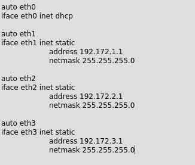


Memasukkan perintah berikut agar node dapat terhubung internet.


-   Loguetown

Melakukan konfigurasi sebagai DHCP Client.

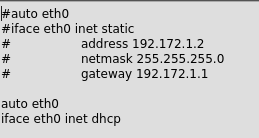


-   Alabasta

Melakukan konfigurasi sebagai DHCP Client.

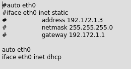


-   EniesLobby

Melakukan konfigurasi sebagai DNS Server dengan alokasi IP yaitu
192.172.2.2.

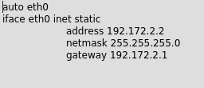


Install kebutuhan DNS Server.

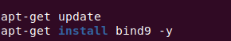


-   Water7

Melakukan konfigurasi sebagai Proxy Server dengan alokasi IP yaitu
192.171.2.3.

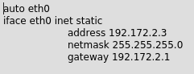


Install kebutuhan Proxy Server.

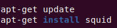


-   Jipangu

Melakukan konfigurasi sebagai DHCP Server dengan alokasi IP yaitu
192.171.2.4.

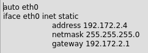


Install kebutuhan DHCP Server.

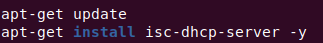


-   Skypie

Melakukan konfigurasi sebagai DHCP Client.

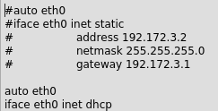


-   TottoLand

Melakukan konfigurasi sebagai DHCP Client.

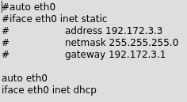


## Nomor 2
Membuat Foosha sebagai DHCP Relay.
### Jawab

Menuliskan perintah-perintah yang digunakan ke dalam bash script di
Foosha. Perintah ini terdiri dari konfigurasi dhcp relay yang mengarah
ke IP Jipangu dengan semua interfae disambungkan.

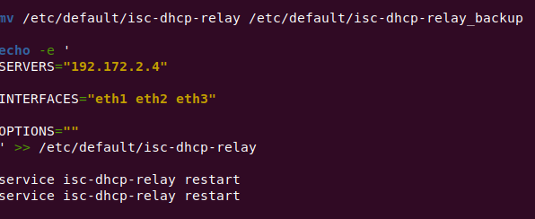

## Nomor 3
Setting Client pada Switch 1
### Jawab
Menuliskan perintah-perintah yang digunakan ke dalam bash script di
Jipangu. Perintah ini adalah melakukan konfigurasi pada dhcp server
dengan interface pada eth0.


Kemudian mengatur konfigurasi untuk menentukan range IP pada Switch 1.

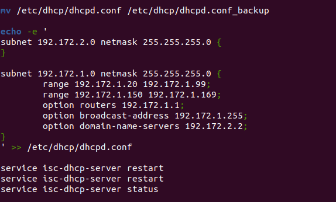


Melakukan testing dengan mencoba restart node Loguetown dan Alabasta,
kemudian membuka console dan melihat IPnya.

-   Loguetown

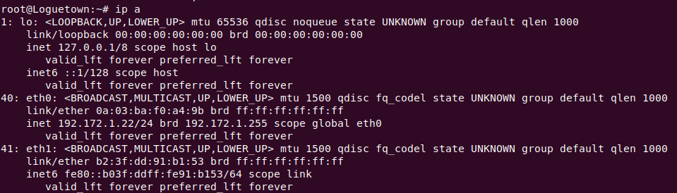


-   Alabasta

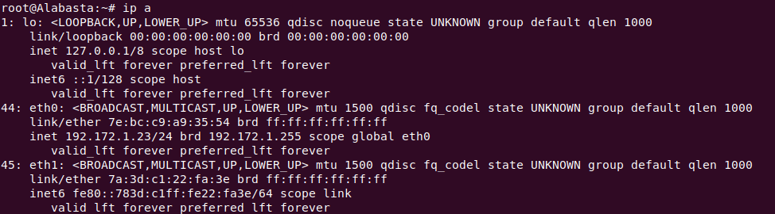

## Nomor 4
Setting Client pada Switch 3
### Jawab
Menambahkan konfigurasi yang digunakan ke dalam bash script di Jipangu.
Konfigurasi ini adalah mengatur konfigurasi untuk menentukan range IP
pada Switch 3.

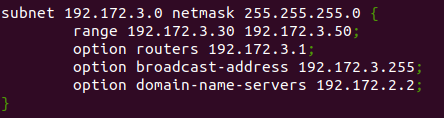


Melakukan testing dengan mencoba restart node Tottoland dan Skypie,
kemudian membuka console dan melihat IPnya.

-   Tottoland


-   Skypie

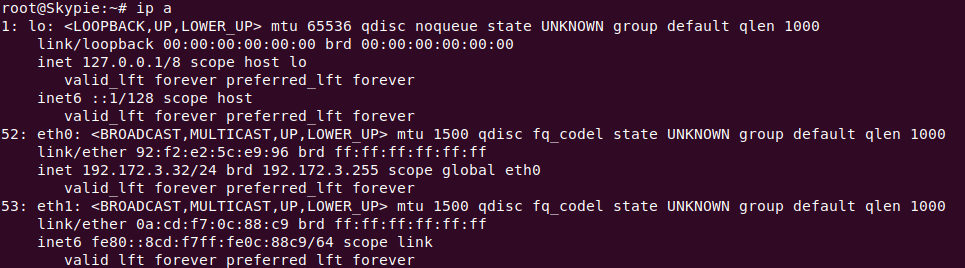

## Nomor 5
Konfigurasi DNS Forwarder pada EniesLobby
### Jawab

Menuliskan perintah-perintah yang digunakan ke dalam bash script di
EniesLobby. Perintah ini adalah melakukan konfigurasi pada bind.

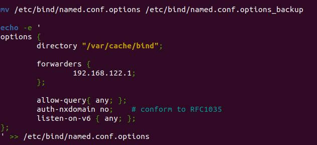


Melakukan testing dengan mencoba restart kemudian membuka console
Loguetown dan melakukan ping google.com.

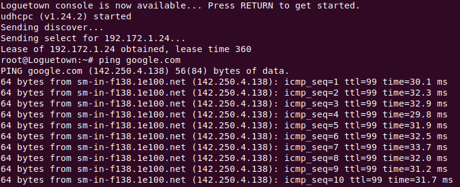

## Nomor 6
Setting Lease Time untuk eth1 dan eth3
### Jawab

Menambahkan konfigurasi yang digunakan ke dalam bash script di Jipangu.
Konfigurasi ini adalah mengatur waktu alokasi IP pada Switch 1 dan
Switch 3.

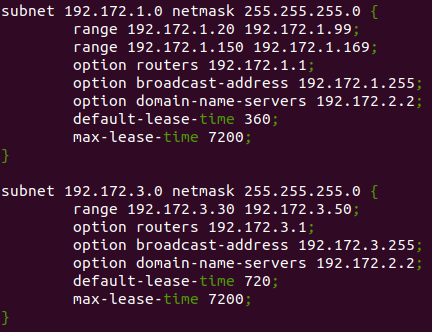

## Nomor 7
Setting Fixed Adress untuk Skypie
### Jawab

Menambahkan konfigurasi yang digunakan ke dalam bash script di Jipangu.
Konfigurasi ini adalah mengatur alokasi IP untuk Skypie pada Switch 3.

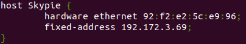


Menambahkan static ethernet pada kofigurasi network di Skypie

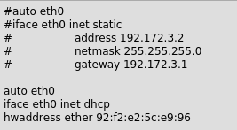}

Melakukan testing dengan mencoba restart kemudian membuka console Skypie
kemudian mengecek IPnya.

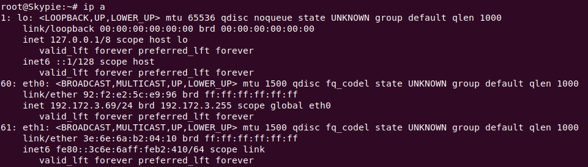


## Nomor 8
Pada Loguetown, proxy harus bisa diakses dengan nama jualbelikapal.a07.com dengan port yang digunakan adalah 5000
### Jawab
1. Buka named.conf.local pada `EniesLobby` 

   ```
   vim /etc/bind/named.conf.local
   ```

2. Isikan configurasi zone domain **franky.a07.com** seperti berikut

   ```
     zone "jualbelikapal.a07.com" {
     type master;
     file "/etc/bind/kaizoku/jualbelikapal.a07.com";
   };
   ```

3. Copykan file `db.local` pada path `/etc/bind` ke dalam folder **kaizoku** yang baru saja dibuat dan ubah namanya menjadi **jualbelikapal.a07.com**

4. Restart bind9 pada `Enieslobby` dengan command `service bind9 restart`

5. Pada Skypie, pindah ke direktori `/etc/apache2/sites-available` lalu _copy_ file **000-default.conf** ke **jualbelikapal.a07.com.conf** dengan perintah

   ```
   cp /etc/apache2/sites-available/000-default.conf /etc/apache2/sites-available/franky.a07.com.conf
   ```

6. Masukkan command berikut pada `Water7`

   ```
   vim /etc/squid/squid.conf
   ```

7. Tambahkan syntax berikut ke squid.conf seperti berikut

   ```
   echo -e '
   http_port 5000
   visible_hostname jualbelikapal.a07.com
   ' >> /etc/squid/squid.conf
   ```

8. Restart squid dengan command `service squid restart` dan jalankan command `lynx google.com` maka akan tampil homepage google.


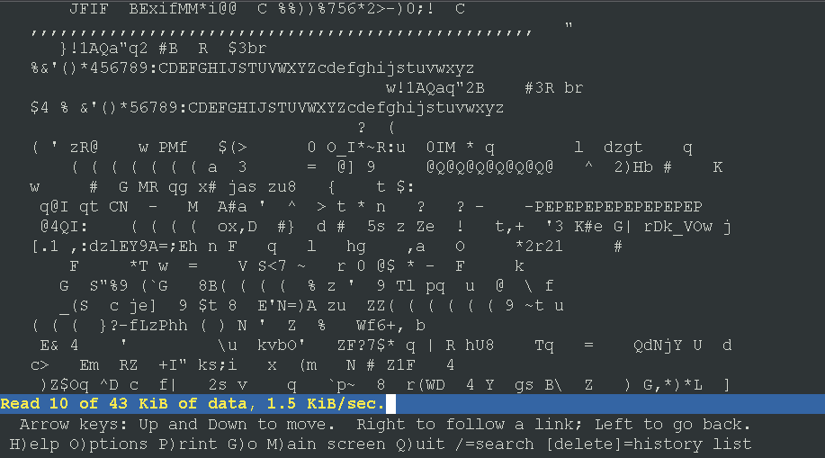


## Nomor 9 
Agar transaksi jual beli lebih aman dan pengguna website ada dua orang, proxy dipasang autentikasi user proxy dengan enkripsi MD5 dengan dua username, yaitu luffybelikapala07 dengan password luffy_a07 dan zorobelikapala07 dengan password zoro_a07
### Jawab
1. Install `apache2-utils` pada Water7 untuk authentikasi

2. Buat user baru dengan command

   ```
   htpasswd -c /etc/squid/passwd luffybelikapala07
   ```

   dan ketikkan password **luffy_a07**.
   Lakukan sekali lagi untuk zoro dengan command

   ```
   htpasswd -m /etc/squid/passwd zorobelikapala07
   ```

   dan ketikkan password **zoro_a07**.


3. Tambahkan syntax berikut pada squid.conf
   ```
   echo -e '
   auth_param basic program /usr/lib/squid/basic_ncsa_auth /etc/squid/passwd
   auth_param basic children 5
   auth_param basic realm Proxy
   auth_param basic credentialsttl 2 hours
   auth_param basic casesensitive on
   acl USERS proxy_auth REQUIRED
   ' >> /etc/squid/squid.conf
   
   ```
4. Restart squid dengan command `service squid restart` dan coba akses sebuah laman website maka tampilannya sebagai berikut


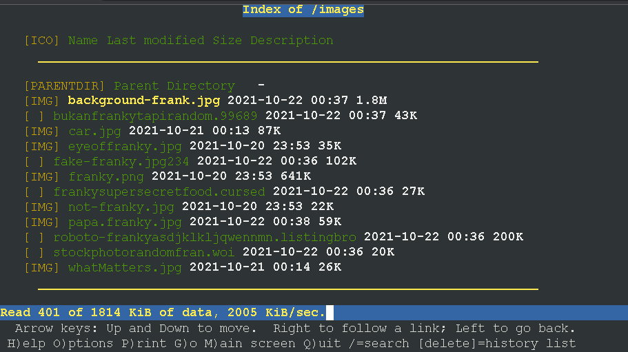


## Nomor 10 
Transaksi jual beli tidak dilakukan setiap hari, oleh karena itu akses internet dibatasi hanya dapat diakses setiap hari Senin-Kamis pukul 07.00-11.00 dan setiap hari Selasa-Jum’at pukul 17.00-03.00 keesokan harinya (sampai Sabtu pukul 03.00)
### Jawab
1. Masukkan command berikut pada `Water7 ` untuk membuka acl.conf

   ```
   vim /etc/squid/acl.conf
   ```

2. Isi konfigurasi sesuai syntax berikut
   ```
   acl AVAILABLE_WORKING time MTWH 07:00-11:00
   acl AVAILABLE_WORKING1 time TWHF 17:00-24:00
   acl AVAILABLE_WORKING2 time WHFA 00:00-03:00
   ```

4. Tambahkan syntax berikut pada squid.conf
   ```
   echo -e '
    include /etc/squid/acl.conf
    http_access allow AVAILABLE_WORKING USERS
    http_access allow AVAILABLE_WORKING1 USERS
    http_access allow AVAILABLE_WORKING2 USERS
    http_access deny all
   ' >> /etc/squid/squid.conf
   
   ```
    dan hapus syntax ini pada konfigurasi squid
    ```
    http_access allow all
    ```

5. Restart squid dengan command `service squid restart` dan coba akses sebuah laman website maka tampilannya sebagai berikut :
    > Jika mengakses di luar jam akses
    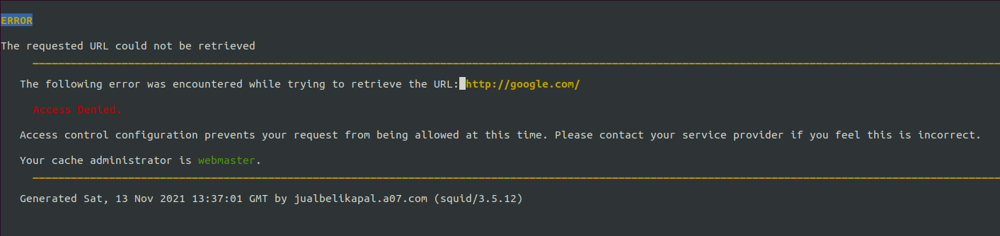

    > Jika mengakses dalam range jam akses
    